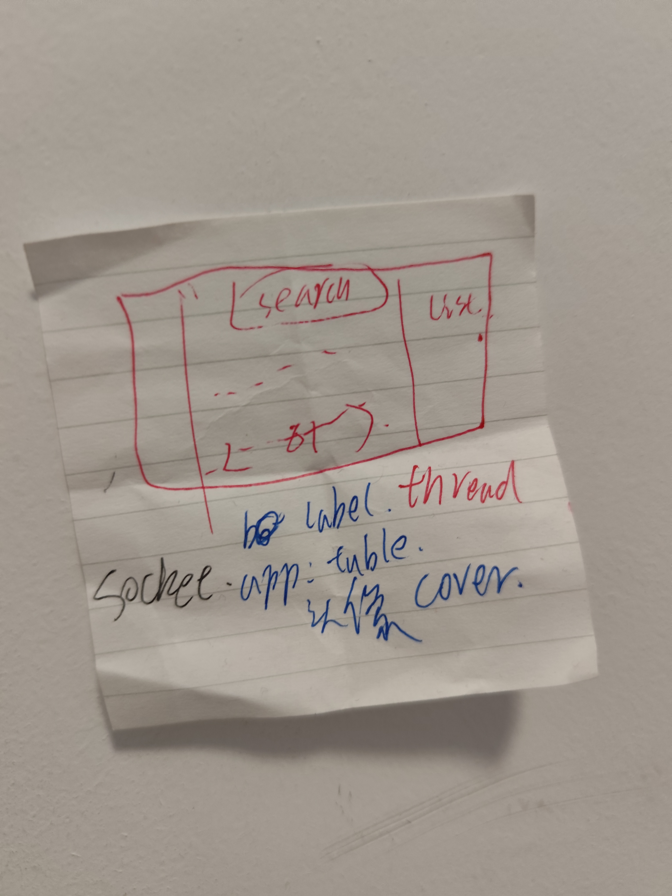

# arch
dwm
emac
nvim config

# blog
[博客维护公告](https://blog.blueke.top/posts/644641/)
[Halo - 强大易用的开源建站工具](https://www.halo.run/)
[博客框架迁移 - Zero](https://vtdd.vip/posts/%E5%8D%9A%E5%AE%A2%E6%A1%86%E6%9E%B6%E8%BF%81%E7%A7%BB/)
git clone note
config to md --py
# tac 后台

# Zen Browser

# 我的世界服务器 整合包 MCSL2  frp Debain  耗电

# Axios

